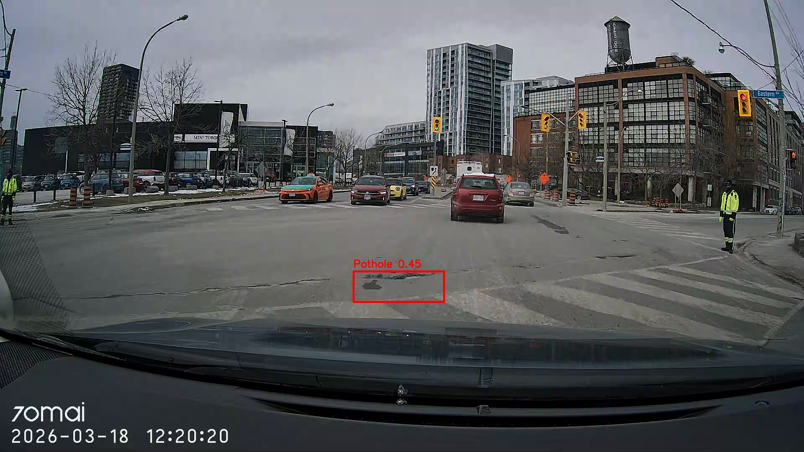

# Toronto Road Intel 🛣️

**Dashcam-based road damage detection and GPS mapping system — built from real Toronto driving data.**

Toronto Road Intel is an end-to-end computer vision pipeline that processes dashcam footage from real driving shifts across Toronto, detects road surface damage using YOLOv8, synchronizes detections with GPS coordinates, and stores structured results in a SQLite database for analysis and dashboard reporting.

---

## Example Detection Output



_Real model output from a March 2026 Toronto driving shift near Eastern Ave. The YOLOv8 model detects road surface damage with confidence 0.45. Bounding box is drawn on the full frame using coordinate shifting from the cropped detection zone._

---

## Pipeline Architecture

```
Dashcam Footage (.MP4)
        ↓
video_processor.py   — extracts one frame every 2 seconds
        ↓
gps_sync.py          — attaches GPS coordinates to each frame
        ↓
detection_engine.py  — runs YOLOv8 inference + road zone filtering
        ↓
data_store.py        — saves detections to SQLite database
        ↓
map_visualizer.py    — interactive Folium map (in progress)
        ↓
Dashboard            — Looker Studio visualization (in progress)
```

---

## Project Structure

```
Toronto-road-intel/
├── data/
│   ├── raw_video/          # Dashcam clips organized by date (YYYYMMDD)
│   ├── gps_tracks/         # GPX files from Open GPX Tracker app
│   └── detections/         # SQLite database (road_intel.db)
├── docs/
│   └── images/             # README visuals
├── models/                 # YOLOv8 model weights
├── output/
│   └── annotated_frames/   # Detection output frames with bounding boxes
├── scripts/
│   └── import_shift.sh     # Copies dashcam clips from SD card to project
├── src/
│   ├── video_processor.py  # Frame extraction from MP4 clips
│   ├── gpx_parser.py       # Parses GPX files into pandas DataFrame
│   ├── gps_sync.py         # Matches video frames to GPS coordinates
│   ├── detection_engine.py # YOLOv8 inference with road zone filtering
│   ├── data_store.py       # SQLite create / save / retrieve operations
│   └── map_visualizer.py   # Interactive map rendering (in progress)
├── tests/
│   ├── test_gps_sync.py
│   └── test_gpx_parser.py
├── main.py                 # Pipeline entry point
└── requirements.txt
```

---

## Quickstart

### 1. Clone and install dependencies

```bash
git clone https://github.com/DBakibaba/Toronto-road-intel.git
cd Toronto-road-intel
pip install -r requirements.txt
```

### 2. Set up environment variables

Create a `.env` file in the project root:

```
HF_TOKEN=your_huggingface_token_here
```

> The HuggingFace token is only needed the first time — it downloads the YOLOv8 model weights automatically.

### 3. Import dashcam footage

Connect your dashcam SD card and run:

```bash
bash scripts/import_shift.sh YYYYMMDD
# Example:
bash scripts/import_shift.sh 20260305
```

Place the corresponding GPX file in `data/gps_tracks/`.

### 4. Run the pipeline

```bash
# Process 10 clips (default)
python main.py --date 20260305

# Process specific number of clips
python main.py --date 20260305 --clips 20

# Process all clips from a shift
python main.py --date 20260305 --clips all
```

### 5. Query results

```python
from src.data_store import get_all_detections

rows = get_all_detections()
for row in rows:
    print(row)
```

---

## Data Captured Per Detection

Each detected event is stored with the following fields:

| Field           | Description                                 |
| --------------- | ------------------------------------------- |
| `damage_type`   | Type of detection (currently: Pothole)      |
| `confidence`    | Model confidence score (0.0 – 1.0)          |
| `lat` / `lon`   | GPS coordinates at time of detection        |
| `elevation`     | Meters above sea level                      |
| `timestamp_utc` | UTC timestamp of the frame                  |
| `clip_filename` | Source video clip                           |
| `frame_number`  | Frame index within the clip                 |
| `interpolated`  | Whether GPS was interpolated between points |

---

## Known Limitations

### 1. Visual similarity — oil stains and road markings

The current model achieves approximately 40–50% precision on Toronto roads. The primary false positive sources are dark oil stains, tire marks, and road patches that are visually similar to potholes in 2D. The model cannot distinguish surface texture depth from a dashcam image alone.

**Next step:** Collect labeled dataset using Roboflow and fine-tune the model on Toronto-specific road conditions.

### 2. Streetcar tracks

Toronto's streetcar network creates false positives — track grooves are dark, narrow, and run along the road surface in a pattern the model confuses with road damage. An aspect ratio filter is planned to eliminate wide flat detections.

### 3. Crosswalk false positives

The brightness filter (rejecting detections with mean pixel value > 180) reduces crosswalk false positives but does not eliminate them entirely.

### 4. Fixed ROI crop during turns

The interactive crop zone is tuned for straight driving. During turns the lane shifts left or right in the frame, potentially causing the detection zone to miss road damage or include sidewalk area.

**Next step:** Dynamic crop zone that follows lane position — requires a separate lane detection model.

### 5. Timezone handling

GPS sync automatically handles both Toronto winter time (UTC-5 / EST) and daylight saving time (UTC-4 / EDT) using `pytz` — no manual adjustment needed when switching seasons.

---

## Roadmap

- [x] Interactive ROI crop window for tuning detection zone
- [x] Brightness filter to reject white road markings
- [x] Duplicate GPS detection filter to prevent repeated saves at red lights
- [x] Batch processing with cooldown for long shift runs
- [ ] Aspect ratio filter to reject streetcar track detections
- [ ] Folium interactive map showing detection hotspots across Toronto
- [ ] Looker Studio dashboard for detection visualization
- [ ] Fine-tune YOLOv8 on labeled Toronto road data using Roboflow
- [ ] Dynamic crop zone that follows lane position during turns
- [x] Daylight saving time support in GPS sync

---

## Tech Stack

- **Python 3.11**
- **YOLOv8** (Ultralytics) — object detection
- **OpenCV** — video processing, frame annotation, interactive crop UI
- **gpxpy** — GPX file parsing
- **pandas** — GPS data manipulation
- **SQLite** — structured detection storage
- **Folium** — interactive map visualization (in progress)
- **Looker Studio** — dashboard (in progress)

---

## Hardware

- **Dashcam:** 70mai A810 (4K, 30fps)
- **GPS:** Open GPX Tracker (iOS) — records `.gpx` tracks synchronized with driving shifts

---

## Data Privacy

Raw dashcam footage and GPX files are **not committed to this repository** — they contain location data from real Toronto driving routes. Only processed detection results (coordinates + confidence scores) are stored.

---

## Author

**Dogukan Bakibaba**
Computer Programming Student — Seneca Polytechnic (graduating April 2026)
Bachelor of Engineering, Mechanical Engineering — Akdeniz University

[LinkedIn](https://www.linkedin.com/in/dogukan-bakibaba-4631a03b0) · [GitHub](https://github.com/DBakibaba)
