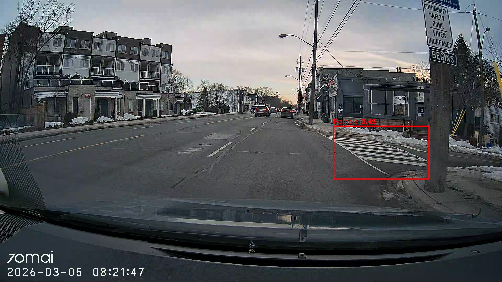

# Toronto Road Intel 🛣️

**Dashcam-based road damage detection and GPS mapping system — built from real Toronto driving data.**

Toronto Road Intel is an end-to-end computer vision pipeline that processes dashcam footage from real driving shifts across Toronto, detects road surface damage using YOLOv8, synchronizes detections with GPS coordinates, and stores structured results in a SQLite database for analysis and dashboard reporting.

---

## Example Detection Output



_Real model output from a March 2026 Toronto driving shift. YOLOv8 detects a region of interest with confidence 0.49. Note: the current model produces false positives on crosswalk markings — a known limitation being actively investigated (see Known Limitations below)._

---

## Pipeline Architecture

```
Dashcam Footage (.MP4)
        ↓
video_processor.py   — extracts one frame every 2 seconds
        ↓
gps_sync.py          — attaches GPS coordinates to each frame
        ↓
detection_engine.py  — runs YOLOv8 inference + road zone filtering
        ↓
data_store.py        — saves detections to SQLite database
        ↓
Dashboard            — Looker Studio visualization (in progress)
```

---

## Project Structure

```
Toronto-road-intel/
├── data/
│   ├── raw_video/          # Dashcam clips organized by date (YYYYMMDD)
│   ├── gps_tracks/         # GPX files from Open GPX Tracker app
│   └── detections/         # SQLite database (road_intel.db)
├── docs/
│   └── images/             # README visuals
├── models/                 # YOLOv8 model weights
├── output/
│   └── annotated_frames/   # Detection output frames with bounding boxes
├── scripts/
│   └── import_shift.sh     # Copies dashcam clips from SD card to project
├── src/
│   ├── video_processor.py  # Frame extraction from MP4 clips
│   ├── gpx_parser.py       # Parses GPX files into pandas DataFrame
│   ├── gps_sync.py         # Matches video frames to GPS coordinates
│   ├── detection_engine.py # YOLOv8 inference with road zone filtering
│   ├── data_store.py       # SQLite create / save / retrieve operations
│   └── map_visualizer.py   # Interactive map rendering (in progress)
├── tests/
│   ├── test_gps_sync.py
│   └── test_gpx_parser.py
├── main.py                 # Pipeline entry point
└── requirements.txt
```

---

## Quickstart

### 1. Clone and install dependencies

```bash
git clone https://github.com/DBakibaba/Toronto-road-intel.git
cd Toronto-road-intel
pip install -r requirements.txt
```

### 2. Set up environment variables

Create a `.env` file in the project root:

```
HF_TOKEN=your_huggingface_token_here
```

> The HuggingFace token is only needed the first time — it downloads the YOLOv8 model weights automatically.

### 3. Import dashcam footage

Connect your dashcam SD card and run:

```bash
bash scripts/import_shift.sh YYYYMMDD
# Example:
bash scripts/import_shift.sh 20260305
```

Place the corresponding GPX file in `data/gps_tracks/`.

### 4. Run the pipeline

```bash
# Process 10 clips (default)
python main.py --date 20260305

# Process specific number of clips
python main.py --date 20260305 --clips 20

# Process all clips from a shift
python main.py --date 20260305 --clips all
```

### 5. Query results

```python
from src.data_store import get_all_detections

rows = get_all_detections()
for row in rows:
    print(row)
```

---

## Data Captured Per Detection

Each detected event is stored with the following fields:

| Field           | Description                                 |
| --------------- | ------------------------------------------- |
| `damage_type`   | Type of detection (currently: Pothole)      |
| `confidence`    | Model confidence score (0.0 – 1.0)          |
| `lat` / `lon`   | GPS coordinates at time of detection        |
| `elevation`     | Meters above sea level                      |
| `timestamp_utc` | UTC timestamp of the frame                  |
| `clip_filename` | Source video clip                           |
| `frame_number`  | Frame index within the clip                 |
| `interpolated`  | Whether GPS was interpolated between points |

---

## Known Limitations

### 1. Winter conditions

The YOLOv8 model used (`Pothole-Finetuned-YoloV8`) was not specifically trained on Canadian winter road conditions. Snow coverage, salt staining, wet asphalt, and low-contrast lighting reduce detection accuracy. This is the primary challenge being investigated.

### 2. Crosswalk false positives

The model currently confuses crosswalk paint markings with road damage in some frames. A crosswalk exclusion filter is being considered as a next step.

### 3. Hardcoded winter timezone

GPS sync currently assumes Toronto winter time (UTC-5 / EST). Daylight saving time (UTC-4) handling is not yet implemented.

---

## Roadmap

- [ ] Crosswalk exclusion filter to reduce false positives
- [ ] Looker Studio dashboard for detection visualization
- [ ] Interactive map showing detection hotspots across Toronto
- [ ] Daylight saving time support in GPS sync
- [ ] Explore brand/signage detection from driver perspective as a future extension

---

## Tech Stack

- **Python 3.11**
- **YOLOv8** (Ultralytics) — object detection
- **OpenCV** — video processing and frame annotation
- **gpxpy** — GPX file parsing
- **pandas** — GPS data manipulation
- **SQLite** — structured detection storage
- **Looker Studio** — dashboard (in progress)

---

## Hardware

- **Dashcam:** 70mai A810 (4K, 30fps)
- **GPS:** Open GPX Tracker (iOS) — records `.gpx` tracks synchronized with driving shifts

---

## Data Privacy

Raw dashcam footage and GPX files are **not committed to this repository** — they contain location data from real Toronto driving routes. Only processed detection results (coordinates + confidence scores) are stored.

---

## Author

**Dogukan Bakibaba**
Computer Programming Student — Seneca Polytechnic (graduating April 2026)
Bachelor of Engineering, Mechanical Engineering — Akdeniz University

[LinkedIn](https://www.linkedin.com/in/dogukan-bakibaba-4631a03b0) · [GitHub](https://github.com/DBakibaba)
